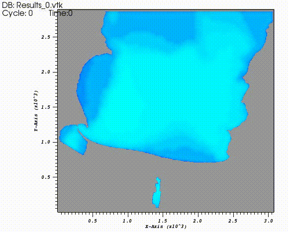

# A 2D-3D COUPLED CATCHMENT-LAKE MODEL FOR MULTI-CORE AND GPU ARCHITECTURES
Developer: Tomas Carlotto

    Prerequisites for using parallel code:
    Computer equipped with NVIDIA GPU (compatible with CUDA technology).
    Software required: CUDA™ Toolkit 10.0 or later 
                  
    System: Linux
         

To use the SW2D-EFDC model, perform the following procedures:
 
1 - Install the prerequisites listed in the files 01_INSTALL_CUDA_and_DRIVERS_NVIDIA.txt and 02_EFDC_DEPENDENCIES.txt

2 - Enter the folder where the SW2D-EFDC.cu file is located

3 - In the command window of your Linux environment, make the compilation using the command:
make

4 - To run the example use the following command line:

./SW2D-EFDC

5 - Modify the files provided in the example, according to the needs of your study.

For any queries, please contact us by email: thomas.carl@hotmail.com

Any collaboration will be highly appreciated!

Example: Pond Breaking - Conceição Lagoon

Coupled model:

 

Hydrodynamic - Tracer simulation - concentration (mg/L):

